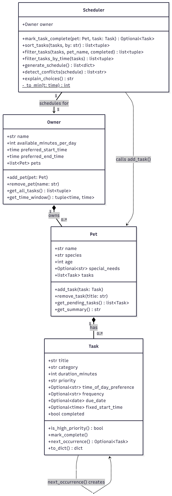

# PawPal+ (Module 2 Project)

You are building **PawPal+**, a Streamlit app that helps a pet owner plan care tasks for their pet.

## Scenario

A busy pet owner needs help staying consistent with pet care. They want an assistant that can:

- Track pet care tasks (walks, feeding, meds, enrichment, grooming, etc.)
- Consider constraints (time available, priority, owner preferences)
- Produce a daily plan and explain why it chose that plan

Your job is to design the system first (UML), then implement the logic in Python, then connect it to the Streamlit UI.

## What you will build

Your final app should:

- Let a user enter basic owner + pet info
- Let a user add/edit tasks (duration + priority at minimum)
- Generate a daily schedule/plan based on constraints and priorities
- Display the plan clearly (and ideally explain the reasoning)
- Include tests for the most important scheduling behaviors

## Smarter Scheduling

The `Scheduler` class goes beyond a simple priority list. Four features make the daily plan more accurate and useful:

**Sort by time of day** — `sort_tasks(by="time")` groups tasks into morning, afternoon, and evening slots before sorting by priority within each slot. Tasks with no preference fall to the end. This keeps related activities (all morning feeding and medication) naturally clustered together.

**Recurring tasks** — `Task` accepts a `frequency` field (`"daily"` or `"weekly"`) and a `due_date`. When `mark_task_complete()` is called on a recurring task, the scheduler automatically creates the next occurrence using Python's `timedelta` and adds it to the pet's task list — no manual re-entry needed.

**Pinned start times** — tasks can declare a `fixed_start_time` (e.g. a vet appointment at 09:00). The scheduler places that task at its exact clock time instead of packing it sequentially, while the rest of the day fills in around it.

**Conflict detection** — `detect_conflicts()` checks every pair of scheduled entries for overlapping time windows using the interval-overlap condition (`start_A < end_B and start_B < end_A`). It returns plain-English warning messages rather than crashing, so the owner is informed without losing the rest of the schedule.

## Testing PawPal+

### How to run

```bash
python -m pytest test_pawpal.py -v
```

### What's tested

The test suite has 25 tests that check the three main features added in this module:

- **Sorting** — tasks come back in the right order (high priority first, or morning before afternoon before evening)
- **Recurring tasks** — marking a daily task complete creates a new one for tomorrow; weekly tasks push out 7 days; one-time tasks don't create anything new
- **Conflict detection** — two tasks at the same time trigger a warning; tasks that don't overlap don't

It also covers a few edge cases that are easy to miss: a pet with no tasks, a task that exactly fills the time budget, and what happens when every task is already completed.

### Confidence level

★★★ 3/5 — All 25 tests pass and the core logic feels solid. Additional teting is needed through UI and edge cases with users

## Getting started

### Setup

```bash
python -m venv .venv
source .venv/bin/activate  # Windows: .venv\Scripts\activate
pip install -r requirements.txt
```

### Suggested workflow

1. Read the scenario carefully and identify requirements and edge cases.
2. Draft a UML diagram (classes, attributes, methods, relationships).
3. Convert UML into Python class stubs (no logic yet).
4. Implement scheduling logic in small increments.
5. Add tests to verify key behaviors.
6. Connect your logic to the Streamlit UI in `app.py`.
7. Refine UML so it matches what you actually built.


## Features

- **Owner & pet setup** — enter your name, daily time budget, preferred hours, and one pet with optional special-needs notes.
- **Task management** — add tasks with title, category, priority (high/medium/low), duration, and an optional time-of-day preference. Delete tasks individually.
- **Priority scheduling** — tasks are sorted high → medium → low and greedily fitted into the daily time budget. Tasks that don't fit are dropped and explained.
- **Sorting by time of day** — the generated schedule can be re-sorted morning → afternoon → evening without regenerating.
- **Daily & weekly recurrence** — marking a recurring task complete automatically creates the next occurrence using `timedelta`, so it reappears in future schedules.
- **Pinned start times** — a task with a fixed clock time (e.g. a vet appointment at 09:00) is placed at that exact time instead of packed sequentially.
- **Conflict detection** — every pair of scheduled tasks is checked for overlapping time windows; warnings appear above the schedule table.
- **Schedule explanation** — the "Why these tasks?" panel shows a budget progress bar, every included task with its priority colour, and every dropped task with the reason.

## Demo

**1. Owner & pet setup**


**2. Adding a task**


**3. Task list**


**4. Generated schedule with conflict warning**


**5. Schedule metrics**


**6. Why these tasks?**


## UML diagram

!

